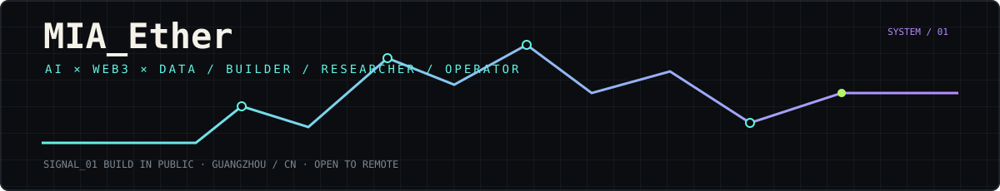
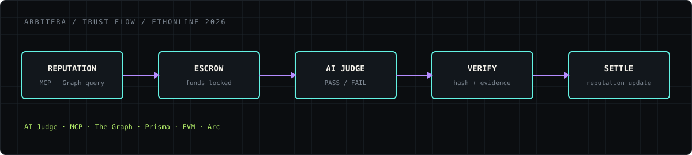
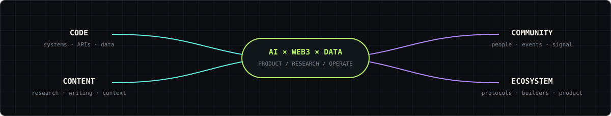
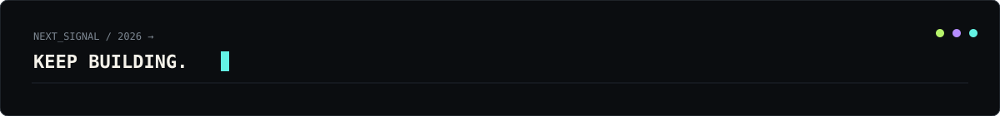

# MIA_Ether

### AI × WEB3 × DATA

`Builder` / `Researcher` / `Operator`



## BUILDING IN PUBLIC

> Building at the intersection of AI, Web3, Data & Finance.

<a href="https://github.com/mia03ther"><kbd>GitHub</kbd></a> <a href="https://x.com/MIA03ther"><kbd>X</kbd></a> <a href="https://mia03ther.github.io/"><kbd>Portfolio</kbd></a> <a href="mailto:mia03ther@gmail.com"><kbd>Email</kbd></a>

### CURRENT FOCUS

`AI AGENTS`   `MCP`   `ON-CHAIN DATA`   `WEB3`   `DATA`   `FINANCE`

<sub>Guangzhou, China · Open to internships, remote collaboration & builder opportunities</sub>

---

## WHO IS MIA_Ether?

I build at the intersection of **technical systems, emerging protocols, data, and public communication**.

My work sits across:

`BUILD` · `RESEARCH` · `SHIP` · `DOCUMENT`

**Core domains**

`AI` · `Web3` · `Data` · `Finance`

**Working style**

Technical + Research + Content + Community

---

## PROOF OF WORK

### ARBITERA

**AI-operated Escrow Court & Agent Reputation Protocol**

An agent-facing trust layer that connects:

`REPUTATION` → `ESCROW` → `AI EVALUATION` → `SETTLEMENT` → `REPUTATION`

### MY ROLE

**AI Judge & Backend Contributor**

Contributed to the AI judge logic, backend flows, MCP reputation layer, and verification path through async GitHub collaboration.

### CONTRIBUTION SURFACE

`AI Judge logic` · `deterministic PASS / FAIL` · `verdictReasoningHash`

`/api/judge` · `/api/judge-and-settle`

`MCP + The Graph reputation flows`

`Subgraph / Arc Testnet validation` · `Prisma persistence` · `API checks` · `debugging` · `tests`

### STACK

`TypeScript` `Node.js` `Prisma` `MCP` `LLM` `The Graph` `EVM` `Arc`



[GitHub →](https://github.com/Ali-Adel-Nour/Arbitera)

> Contribution record, not a founder claim.

---

## SELECTED BUILDS

### `01 /` ARBITERA

**AI-operated Escrow Court & Agent Reputation Protocol**

AI Judge + escrow + MCP reputation workflow for autonomous agents.

`TypeScript` `Prisma` `MCP` `The Graph` `EVM`

[Repository →](https://github.com/Ali-Adel-Nour/Arbitera)

### `02 /` PC BUILD CONFIG GENERATOR

An open-source CLI for turning budget, component, and device constraints into practical PC recommendations.

`Python` `CLI` `Testing` `CI`

[Repository →](https://github.com/mia03ther/pc-build-config-generator)

### `03 /` MYTRADINGCHATSUMMARY

A local AI workflow for parsing, chunking, summarising, and exporting finance-oriented chat data into research notes.

`Python` `Ollama` `Qwen` `HTML Parsing` `Local AI`

[Repository →](https://github.com/mia03ther/MyTradingChatSummary)

---

## WHAT I BUILD WITH

| AREA      | TOOLS / SYSTEMS                                                  |
| --------- | ---------------------------------------------------------------- |
| BUILD     | Python · TypeScript · REST API · Git · Docker · Prisma           |
| AI        | AI Agents · MCP · LLM workflows                                  |
| DATA      | SQL · Data Analysis · On-chain Data                              |
| WEB3      | EVM · Ethereum · Solidity · Smart Contracts · Escrow · The Graph |
| CONTENT   | Technical Writing · Documentation · Bilingual Content            |
| COMMUNITY | Developer Ecosystems · Community · Events                        |

---

## THE HYBRID EDGE



I move between **code, research, content, and community** without losing the technical context.

```text
RESEARCH → BUILD → VALIDATE → SHIP
```

I use GitHub, X, and public documentation to make technical work visible, understandable, and open to collaboration.

---

## SELECTED SIGNALS

| SIGNAL      |                        |
| ----------- | ---------------------- |
| X           | 1K+ followers          |
| Peak Post   | ~900K impressions      |
| Hackathon   | ETHOnline 2026         |
| Open Source | Public GitHub projects |

---

## PUBLIC WORK

`Blockchain Security` · `AI Agent Wallets` · `Web3 Infrastructure`

`AI × Finance` · `On-chain Data` · `Developer Ecosystems`

Research → Translate → Publish → Engage

[ X / Twitter ](https://x.com/MIA03ther) · [ GitHub ](https://github.com/mia03ther) · [ Portfolio ](https://mia03ther.github.io/)

---

## NOW

```text
BUILDING   AI × Web3 projects
LEARNING   AI Agents · On-chain Data · Data Systems
EXPLORING  AI × Finance · Developer Ecosystems
```

## OFF-CHAIN

`Electronic Music / Composition` · `Visual Art / Drawing` · `Digital Culture / Anime`

---

## EDUCATION

**Guangdong University of Foreign Studies**

B.S. in Big Data Management and Applications · `2026–Present`

---

## SIGNALS

`FLTRP English Competition — Zhejiang Provincial First Prize ×2`

`Python Electronics Society Level 4`

`High School Debate — Top Award`

---

## OPEN TO

`AI / Web3 internships` · `Remote collaboration` · `Open-source contribution`

`Developer Ecosystems` · `Technical Content` · `Builder opportunities`

---



# LET'S BUILD.

```text
$ whoami
MIA_Ether

$ focus
AI × Web3 × Data

$ next
Keep building.
```

[GitHub](https://github.com/mia03ther) · [X](https://x.com/MIA03ther) · [Portfolio](https://mia03ther.github.io/) · [Email](mailto:mia03ther@gmail.com)
