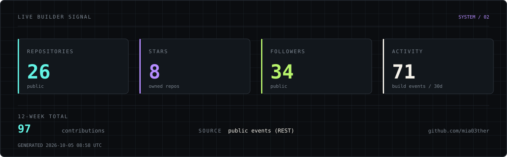
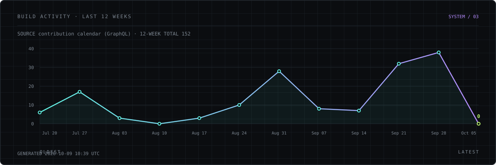
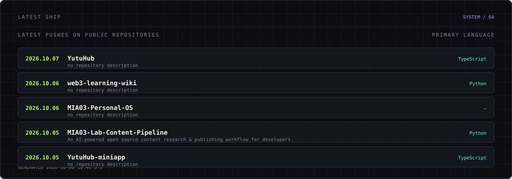

<div align="center">

# MIA_Ether

### AI × WEB3 × DATA

`Builder` / `Researcher` / `Operator`

</div>


---

## BUILDING IN PUBLIC

> I build in public, and this page keeps showing what I am currently building.
> The panels below are generated from real public GitHub data by a workflow that
> runs on its own — nothing here is typed by hand.

<div align="center">

<a href="https://github.com/mia03ther"><kbd>GitHub</kbd></a>
<a href="https://x.com/MIA03ther"><kbd>X</kbd></a>
<a href="https://mia03ther.github.io/"><kbd>Portfolio</kbd></a>
<a href="mailto:mia03ther@gmail.com"><kbd>Email</kbd></a>

</div>

## CURRENT SIGNAL

`AI AGENTS` · `MCP` · `ON-CHAIN DATA` · `WEB3` · `DATA` · `AI × FINANCE`

<sub>Guangzhou, China · GDUFS · Open to internships, remote collaboration & builder opportunities</sub>

---

## LIVE BUILDER SIGNAL



> Public repositories, stars across owned repositories, followers and recent public
> activity — read from the GitHub API, never hard-coded.

---

## BUILD ACTIVITY



<sub>AUTO-UPDATED BUILD ACTIVITY · last 12 weeks · regenerated by GitHub Actions on push and on a daily schedule, not a live browser view</sub>

---

## WHO IS MIA_Ether?

I work where **AI systems, Web3 infrastructure and data** meet, and I turn research
into running software instead of leaving it in notes.

```text
RESEARCH → BUILD → VALIDATE → SHIP → DOCUMENT
```

The through-line is auditability: whether it is an agent verdict, a reputation score
or an on-chain record, I care that the reasoning behind it can be inspected afterwards.


---

## PROOF OF WORK

Collaboration on someone else's repository, shipped in public.

### ARBITERA

**AI-operated escrow court & reputation protocol for the agentic economy**

`REPUTATION` → `ESCROW` → `AI JUDGE` → `VERIFY` → `SETTLE`

**My role — AI Judge & Backend Contributor.**

Work delivered through async GitHub collaboration:

- AI Judge evaluation logic with deterministic `PASS` / `FAIL` verdicts and a canonical reasoning hash
- `/api/judge` and `/api/judge-and-settle` backend routes
- MCP reputation layer reading escrow history via The Graph
- Subgraph indexing and Arc testnet validation, Prisma persistence, API tests

`TypeScript` `Node.js` `Prisma` `MCP` `LLM` `The Graph` `EVM` `Arc`


[Ali-Adel-Nour/Arbitera →](https://github.com/Ali-Adel-Nour/Arbitera)

<sub>Contribution record, not a founder claim.</sub>

---

## CURRENT BUILDS

Everything below is an owned repository, described from its own contents.

### `01 /` YUTUHUB

**AI-native campus knowledge & service hub**

Turns scattered campus experience into a searchable, revisable knowledge asset: AI tool
library with student-measured cost notes, skill exchange settled in contribution points,
a learning wiki with public revision history, community, and a student builder showcase.
Monorepo with `app/`, `server/`, `database/`, Prisma schema and its own `architecture.md`.

`Next.js` `TypeScript` `Tailwind` `Prisma` `Node.js`

[Repository →](https://github.com/mia03ther/YutuHub)

---

### `02 /` YUTUHUB-MINIAPP

**YutuHub on WeChat**

The WeChat mini-program client for YutuHub — campus feed, study collaboration, campus
life and second-hand exchange. Ships as a product demo on mock data with no real
backend wired in yet.

`Mini Program` `TypeScript` `Mock Data`

[Repository →](https://github.com/mia03ther/YutuHub-miniapp)

---

### `03 /` VERITASOS

**Trust infrastructure for autonomous agents**

Agents can negotiate and move value, but they need evidence before delegating.
VeritasOS combines escrow, an AI Judge, on-chain reputation intelligence and MCP agent
tools into an auditable trust layer — `/trust` REST API, `assess_agent_risk` over MCP,
verdict evidence records, and settlement through an existing contract boundary.
States its trust boundaries explicitly instead of claiming the model is trustless.

`AI Agents` `MCP` `Blockchain` `Subgraph` `TypeScript`

[Repository →](https://github.com/mia03ther/VeritasOS)

---

### `04 /` PULSE-DESK

**Review news desk**

A static GitHub Pages desk for market review notes — flashes, daily review, calendar,
announcements and research. Each entry carries its impact, trigger and invalidation
condition and copies cleanly into a community post. Market data is demo data, not a live feed.

`JavaScript` `CSS` `GitHub Pages` `Static`

[Repository →](https://github.com/mia03ther/pulse-desk)

---

### `05 /` X402-AGENT-GATEWAY

**Autonomous x402 payment gateway**

Lets AI agents pay for APIs in USDC on Hedera and Arc, removing the API key from the
request path.

`TypeScript` `USDC` `x402` `Hedera` `Arc`

[Repository →](https://github.com/mia03ther/x402-agent-gateway)

---

### `06 /` WEB3-LEARNING-WIKI

**Open Web3 knowledge archive**

Markdown source for a published knowledge archive on blockchain fundamentals, on-chain
AI agents, hackathon practice and developer tooling. Built with MkDocs and served from
GitHub Pages with sidebar navigation and full-text search.

`Markdown` `MkDocs` `Documentation` `Web3`

[Repository →](https://github.com/mia03ther/web3-learning-wiki) · [Read online →](https://mia03ther.github.io/web3-learning-wiki/)

---

### `07 /` PC-BUILD-CONFIG-GENERATOR

**Budget-aware PC build CLI**

A Python CLI that turns budget, component and device constraints into practical
configurations. Has `pyproject.toml`, a test suite, CI and a roadmap.

`Python` `CLI` `Testing` `CI`

[Repository →](https://github.com/mia03ther/pc-build-config-generator)

---

## CAPABILITIES

<table>
<tr>
<td width="22%"><code>BUILD</code></td>
<td>Python · TypeScript · REST API · Git · Docker · Prisma</td>
</tr>
<tr>
<td><code>AI</code></td>
<td>AI Agents · MCP · LLM workflows · AI-assisted development</td>
</tr>
<tr>
<td><code>DATA</code></td>
<td>SQL · Data Analysis · Data Systems · On-chain Data · Subgraph indexing</td>
</tr>
<tr>
<td><code>WEB3</code></td>
<td>EVM · Smart Contracts · Escrow · The Graph · x402 payments</td>
</tr>
<tr>
<td><code>FRONTEND</code></td>
<td>Next.js · React · Tailwind · WeChat Mini Program · Static GitHub Pages</td>
</tr>
<tr>
<td><code>WRITE</code></td>
<td>Technical Documentation · Research Notes · Bilingual Technical Content</td>
</tr>
</table>

---

## LATEST SHIP LOG



> Most recent pushes across owned public repositories.

---

## CURRENT FOCUS

```text
BUILDING   YutuHub + its WeChat client, and VeritasOS
EXPLORING  Agent trust, MCP surfaces, on-chain data quality
LEARNING   Data Systems · AI × Finance
OPERATING  Open-source contribution · technical writing · public builds
```

---

## SELECTED SIGNALS

`ETHOnline 2026`

`FLTRP English Competition — Zhejiang Provincial First Prize ×2`

`Python Electronics Society — Level 4`

`High School Debate — Top Award`

---

## EDUCATION

**Guangdong University of Foreign Studies**

B.S. in Big Data Management and Applications · `2026–Present`

---

## OFF-CHAIN

`Electronic Music / Composition` · `Visual Art / Drawing` · `Digital Culture / Anime`

---

## OPEN TO

`AI / Web3 internships` · `Remote collaboration` · `Open-source contribution`

`Developer Ecosystems` · `Technical Content` · `Builder opportunities`

---


## LET'S BUILD

```text
$ whoami
MIA_Ether

$ focus
AI × Web3 × Data

$ next
Keep shipping.
```

[GitHub](https://github.com/mia03ther) · [X](https://x.com/MIA03ther) · [Portfolio](https://mia03ther.github.io/) · [Email](mailto:mia03ther@gmail.com)